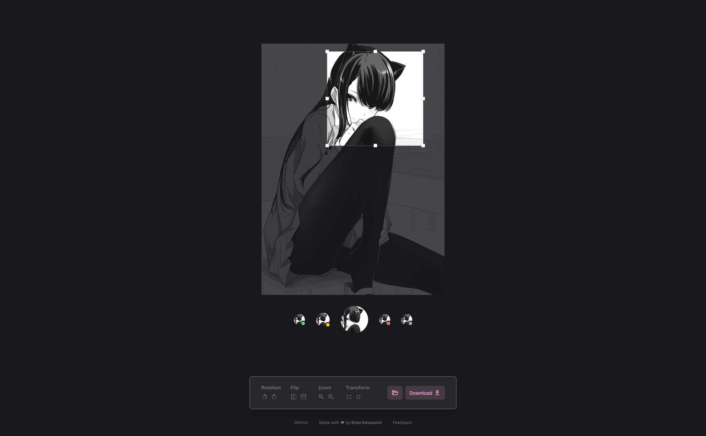

   
  
   

<h2 align="center">Avatar</h2>

   
  

 

  A simple tool for cropping an avatar.
   
  It was made as an alternative to <a href="https://avatarcropper.com">Avatar Cropper</a> to better suit my UI tastes and adapt the tool to my needs.
   
  <a href="https://avatar.innocenzi.dev/">Visit the website</a>

   
  ·
   
   
   
  

   
  ·
   
   
  Built with ❤︎ by <a href="https://twitter.com/enzoinnocenzi">Enzo Innocenzi</a>

